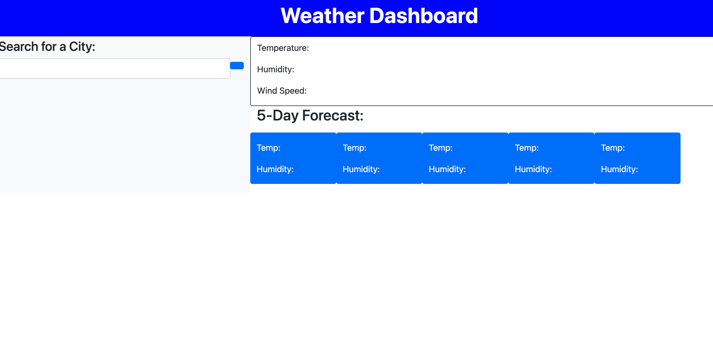
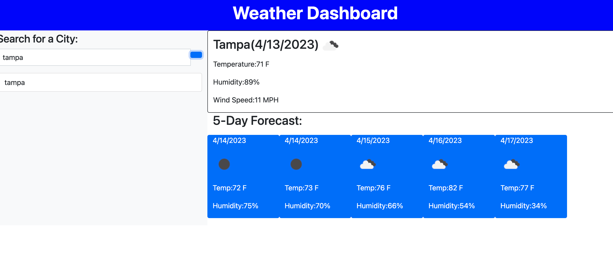
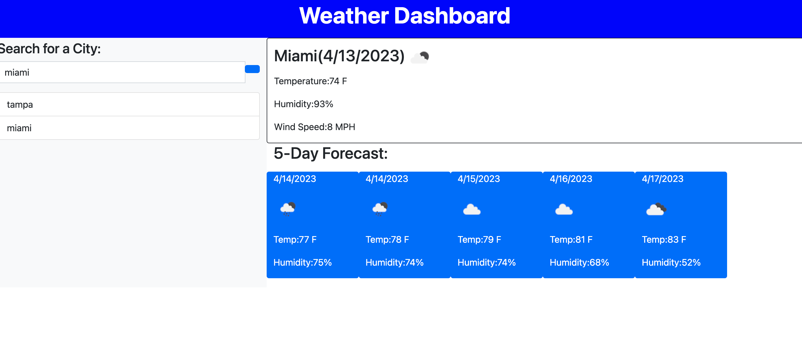
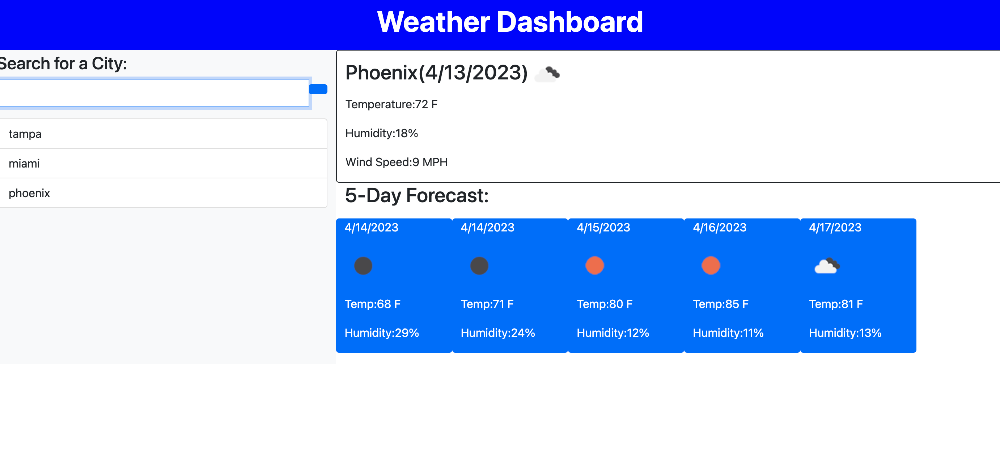

# weather-computing-machine

# 06 Server-Side APIs: Weather Dashboard

Depository Name:

weather-computing-machine

URL:

https://github.com/Dale2k/weather-computing-machine

deployed address:

https://dale2k.github.io/weather-computing-machine/

## Your Task

Third-party APIs allow developers to access their data and functionality by making requests with specific parameters to a URL. Developers are often tasked with retrieving data from another application's API and using it in the context of their own. Your challenge is to build a weather dashboard that will run in the browser and feature dynamically updated HTML and CSS.

## User Story

As an on the go traveler I want to check the weather in various locations,

## Criteria

GIVEN a weather dashboard with form inputs
WHEN I search for a city
THEN I am presented with current and future conditions for that city and that city is added to the search history
WHEN I view current weather conditions for that city
THEN I am presented with the city name, the date, an icon representation of weather conditions, the temperature, the humidity, and the wind speed
WHEN I view future weather conditions for that city
THEN I am presented with a 5-day forecast that displays the date, an icon representation of weather conditions, the temperature, the wind speed, and the humidity.

## Mock-Up

## Installation

deployed address:

https://dale2k.github.io/weather-computing-machine/

## Components

Html, Javascript, Readme.me, Bootstrap, JQuery, CSS.

